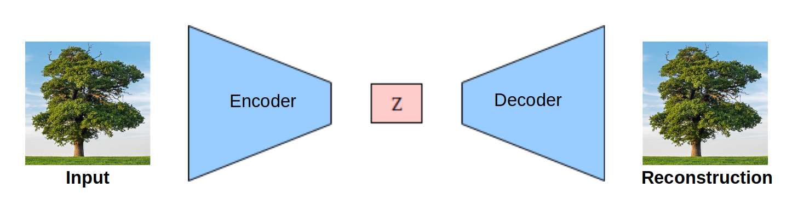
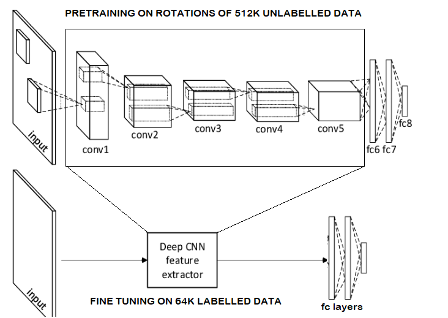

# Variation-Auto-Encoder-for-Semi-supervised-Image-Classification

This repository contains Pytorch implementation of semi-supervised image classification on low resource labelled data. Steps include:

## Training AlexNet based Convolutional Variational Auto Encoder

## Transfer learning: extracting the features from VAE and training a feed forward classifer on top of them.

